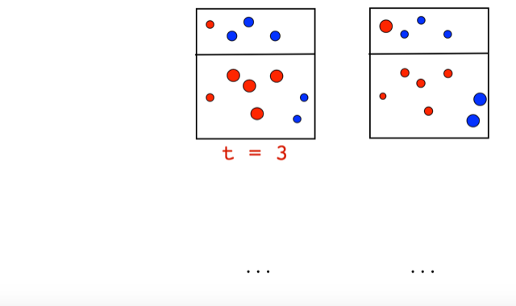
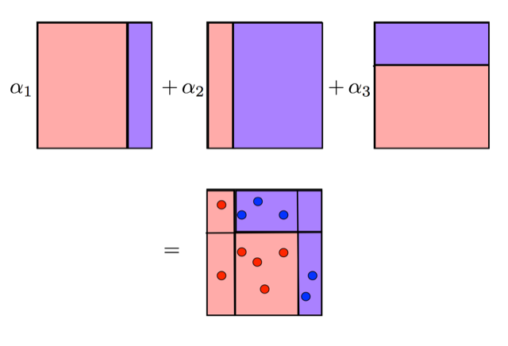

# basic idea

through a weak *learner*, we can learn a series of weak *predictors* and make them into a strong *predictor*.

specifically, given some learning algorithm:

1. use ensemble of predictors, $`h_1, \ldots, h_t`$, each $`h_i`$ with a confidence score $`\alpha_i`$
1. training data's distribution $`D_t(i)`$ (weight on training data points) is **adjusted** based on the current predictor's ($`h_t`$) performance
1. final predictor is $`\sum_{i=1}^T \alpha_i h_i`$

algorithm:

from [these slides](http://www.cs.nyu.edu/~mohri/mls/lecture_6.pdf)

# example (using decision tree stump)

# main theoretical result

the learning error drops exponentially. 

# faster to compute $`D_t(i)`$

normalize:

1. $`\sum_{\text{right }i}D_t(i)=1/2`$
2. $`\sum_{\text{wrong }i}D_t(i)=1/2`$

from [MIT opencource](https://www.youtube.com/watch?v=UHBmv7qCey4)