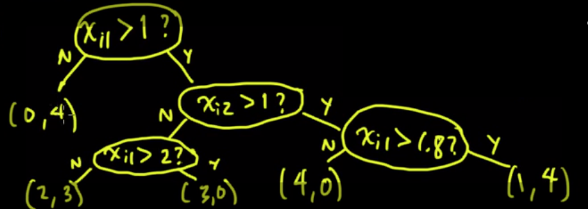
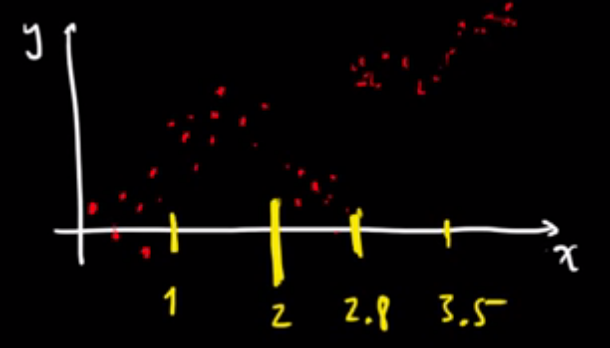
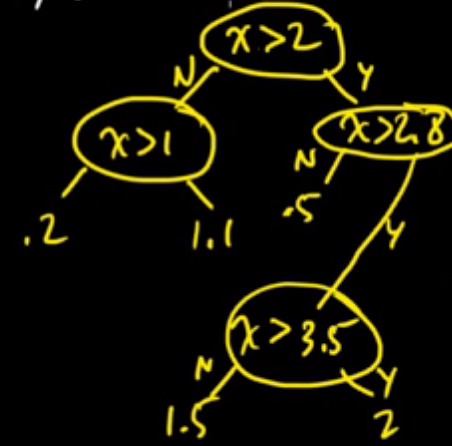

# for classificaiton

[video](https://www.youtube.com/watch?v=p17C9q2M00Q)

basic idea: 

- parition the space into regions like this

internally, its a tree structure

- each leaf represents a region
- prediction is made by going down the tree by evaluating the decision rules and label it by majority voting

# for regression

suppose given a set of 1d points, $`(x_1, y_1), \ldots, (x_n, y_n)`$, where $`x_i, y_i \in \mathbb{R}`$

like the following:

then we have selected the split points (on real domain)

and build a tree that minimizes the training error:

training error is meaured at each **leaf node** as:

$`\sum_i (y_i - \hat{y})^2`$

# growing regression tree

greedily and recursively split the data points into subset of points (regions).

suppose training data points $`(x_1, y_1), \ldots, (x_n, y_n)`$, where $`x_i \in \mathbb{R}^d, y_i \in R`$

then at each step, we select a dimension $`j \in \{1, \ldots, d\}`$ and $`s \in \mathbb{R}`$ such the following is **minimized**:

$`\text{min}_y \sum\limits_{i: x_ij < s} (y_i - y)^2 + \text{min}_y \sum\limits_{i: x_ij \ge s} (y_i - y)^2`$

in other words, we minimize the square loss at **each** region. 

then, we do this recursively at each partition.

# growing classification tree

