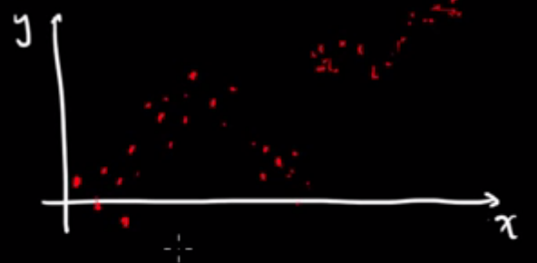

# for classificaiton

[video](https://www.youtube.com/watch?v=p17C9q2M00Q)

basic idea: 

- parition the space into regions like this

internally, its a tree structure

- each leaf represents a region
- prediction is made by going down the tree by evaluating the decision rules and label it by majority voting

# for regression

suppose given a set of 1d points, `(x_1, y_1), \ldots, (x_n, y_n)`, where `x_i, y_i \in \mathbb{R}`

like the following:

then we have selected the split points (on real domain)

and build a tree that minimizes the training error:

training error is meaured at each **leaf node** as:

`\sum_i (y_i - \hat{y})^2`