# grid graph

- [square lattice](https://en.wikipedia.org/wiki/Square_lattice)
- `graph_tool.generation.lattice`

# `remove_vertex`

it's not as cheap as I thought. 

for the adjacency list data structure, it takes $`O(V+E)`$ time. 

because, after node removal, the other node ids change and edges should be updated. 


# contracting a graph by nodes

algorithm idea:

denote the nodes to contract as targets

1. remap the nodes such that targets map to node 0, $`map`$
2. the other nodes map to consecutive and unique integers
3. loop through all edges $`(u, v)`$ and use the mapping to get the new edge
   - new edge is $`(map[v], map[v])`$
   - edge weights can be updated similarly

running time:

1. re-map $`O(V)`$
2. add edges $`O(E)`$
3. total $`O(V+E)`$

# determinant of sparse laplacian matrix

- not easy to compute
- [Cholesky decomposition](https://en.wikipedia.org/wiki/Cholesky_decomposition) can be applied
  - decomposes $`A`$ into $`L D L^T`$, where $`L`$ is lower unit triangular matrix and $`D`$ is diagonal matrix
  - determinant is product of diagonal entries in $`D`$
- [more references](https://stackoverflow.com/questions/19107617/how-to-compute-scipy-sparse-matrix-determinant-without-turning-it-to-dense)

# determinant in practice

- det score is usually very large, $`10^{30}`$
  - may suffer from overflow
- \exp score is much smaller, so divided by det score is very  small ($`10^{-45}`$)
  - may suffer from underflow

# plot

- scatter plot marker size: $`s`$ argument

# Sep 14

main finding:

1. distance between distribution on $`\det`$ and $`\exp`$
2. sample expectation

##  tree size histogram

because:

1. $`\exp`$ can be approximated by $`\det`$
2. $`\exp`$ favors small trees

then I expected $`\det`$ sampler also favors small trees. 

however, the tree size histogram does not agree. 

note that even after resampling, tree size does not improve. 


also, determinant based sampler does not give much preference to high determinant score trees. 


## hellinger distance

[def](https://en.wikipedia.org/wiki/Hellinger_distance\#Discrete_distributions)

- karate: `0.2094`
- dolphin: `0.3946`

det vs energy probas: karate


det vs energy probas: karate

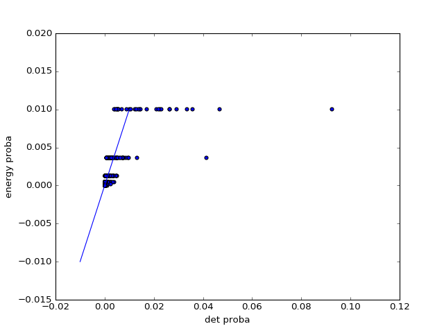

observation:

- trees with large `exp` proba tend to have even higher det proba. 
- it might explain why re-sampling give more smaller trees. 

# sep 18

Aris suggests we look at the uncertainty score before doing any evaluation such as precision and recall. 

so there are good and bad examples:

## good examples

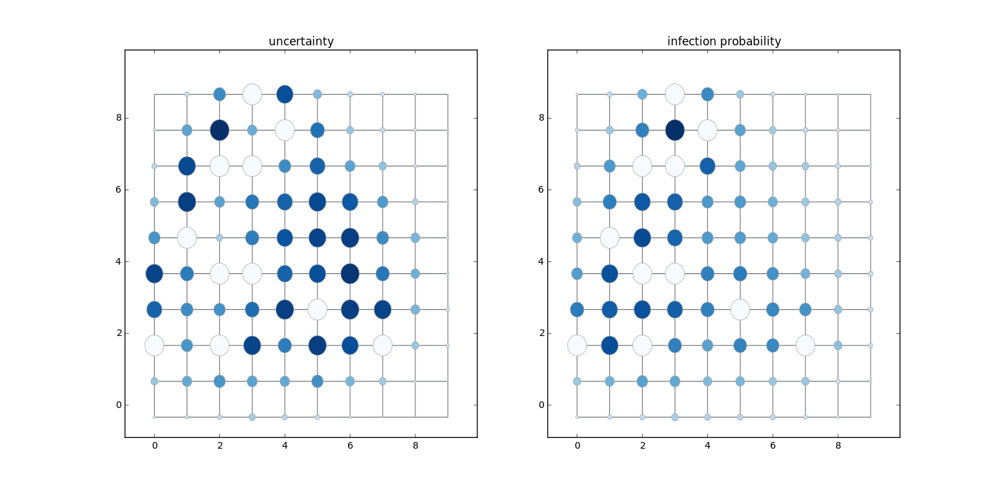

- obs: `[22 15 48 53 37 27  2 34 24 39 72]`

## ok example

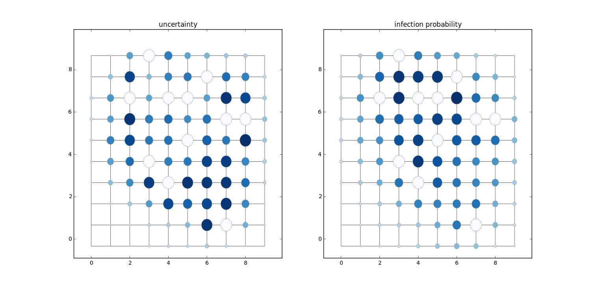

- obs: `[71 86 47 39 27 76 43 55 34 68 57]`

uncertainty on the lower right part is over-estimated

## bad examples

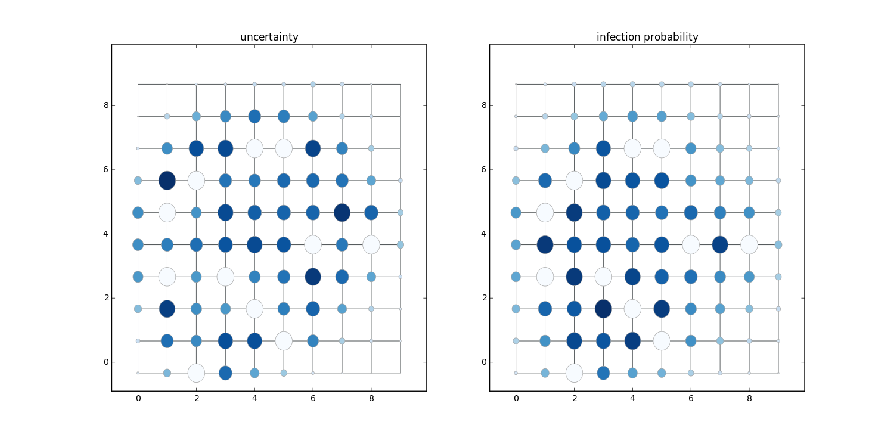

- obs: `[33 13 20 42 57 51 47 26 15 64 84]`

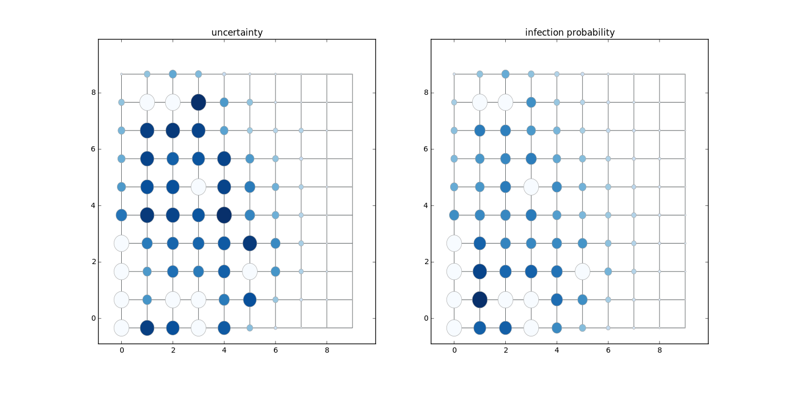

- obs: `[31  1 21 30 35  2 52 28  3 18  0]`

## dolphin network

0.1 nodes are sampled

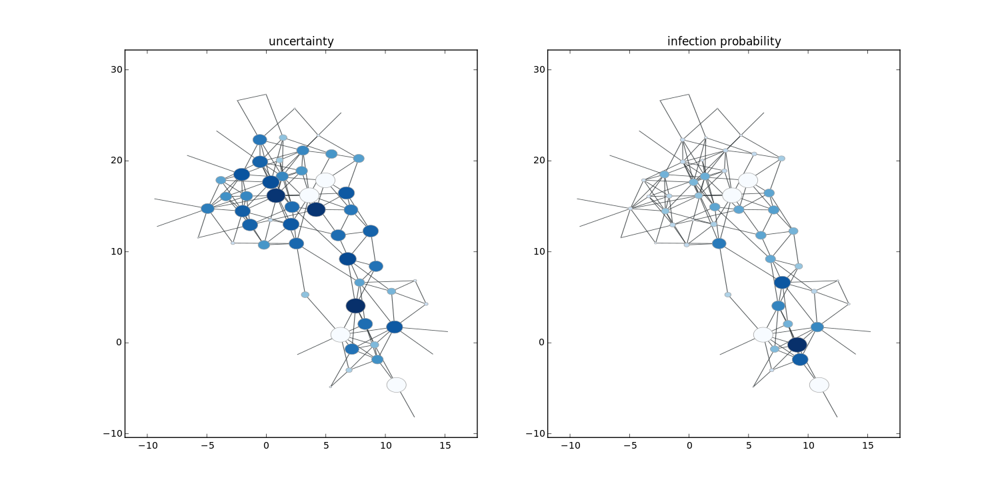

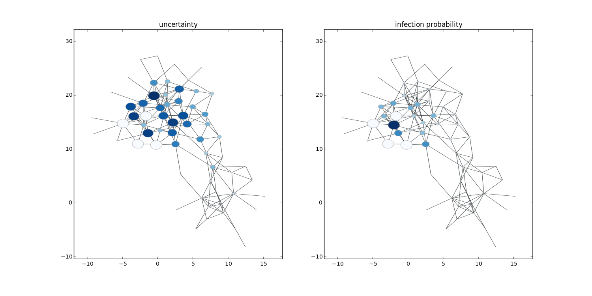

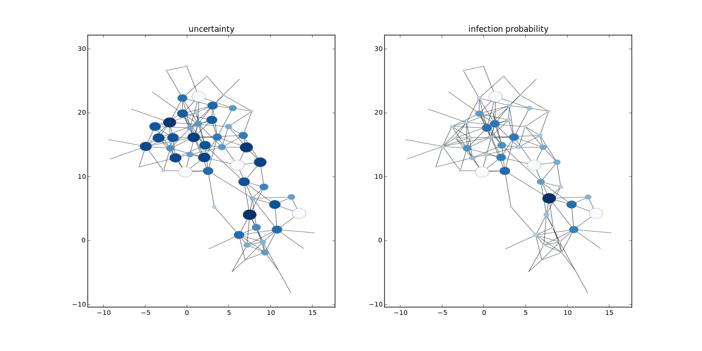


## karate network

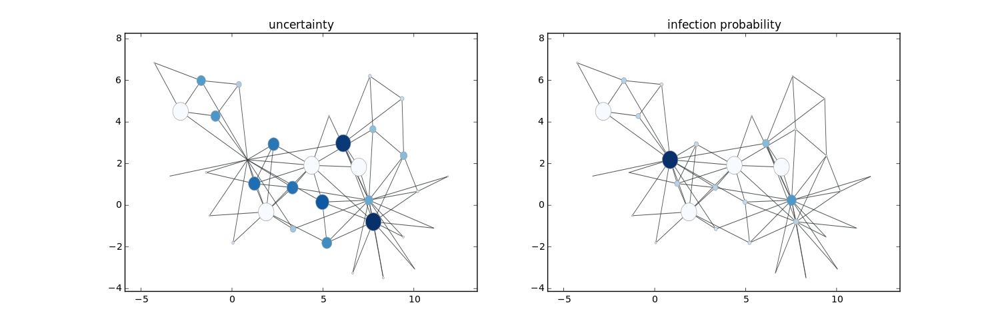

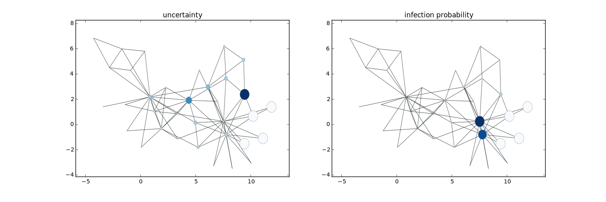


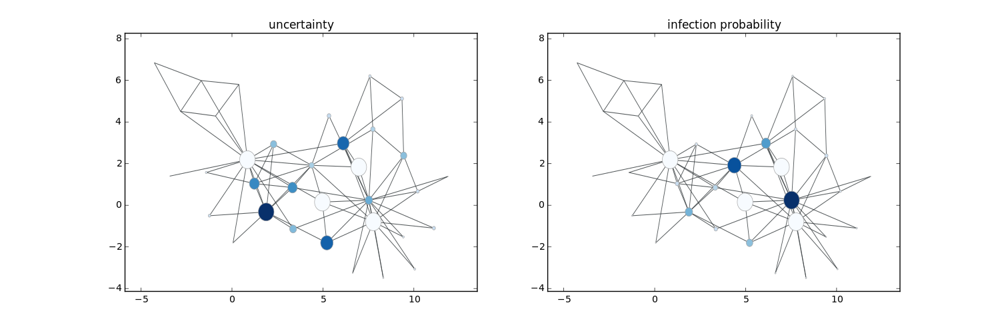


## new doubt

1. are *small* steiner trees good appriximation to the real cascade?

- does SI model encourage small trees?
   -  if not, is tree diameter a better measure for quality?
- why not use other random tree generator based on the underlying cascade model?

# sep 19: computation bottle neck

```
   111        10           32      3.2      0.0          det_scores = [det_score_of_steiner_tree(st, g)
   112        10     16416741 1641674.1     79.5                        for st in steiner_tree_samples]
```

acutally the bottle neck is computing laplacian

```
    16      1000      3380914   3380.9     89.6      l = laplacian(g, weight=weights)
```


# sep 22

## sampling based inference

gives better result.

notebook: http://193.166.24.212:9999/notebooks/compare_inference_method.ipynb

## our method vs pagerank

gives better result

## why performance drops

first reason: sometimes after the query, the prediction does not change, 

however the queried node (which is a correct prediction) is removed from the prediction, thus making it performance drop. 

second reason: 

- spanning trees should not be re-used . for queried nodes are **not** infected, some old spanning trees are not spanning trees for the new graph. 

