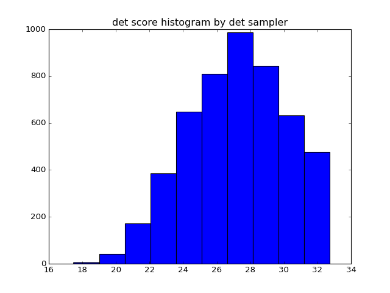

# grid graph

- [square lattice](https://en.wikipedia.org/wiki/Square_lattice)
- `graph_tool.generation.lattice`

# `remove_vertex`

it's not as cheap as I thought. 

for the adjacency list data structure, it takes $`O(V+E)`$ time. 

because, after node removal, the other node ids change and edges should be updated. 

# contracting a graph by nodes

algorithm idea:

denote the nodes to contract as targets

1. remap the nodes such that targets map to node 0, $`map`$
2. the other nodes map to consecutive and unique integers
3. loop through all edges $`(u, v)`$ and use the mapping to get the new edge
   - new edge is $`(map[v], map[v])`$
   - edge weights can be updated similarly

running time:

1. re-map $`O(V)`$
2. add edges $`O(E)`$
3. total $`O(V+E)`$

# determinant of sparse laplacian matrix

- not easy to compute
- [Cholesky decomposition](https://en.wikipedia.org/wiki/Cholesky_decomposition) can be applied
  - decomposes $`A`$ into $`L D L^T`$, where $`L`$ is lower unit triangular matrix and $`D`$ is diagonal matrix
  - determinant is product of diagonal entries in $`D`$
- [more references](https://stackoverflow.com/questions/19107617/how-to-compute-scipy-sparse-matrix-determinant-without-turning-it-to-dense)

# determinant in practice

- det score is usually very large, $`10^{30}`$
  - may suffer from overflow
- \exp score is much smaller, so divided by det score is very  small ($`10^{-45}`$)
  - may suffer from underflow

# plot

- scatter plot marker size: $`s`$ argument

# Sep 14

main finding:

1. correlation between $`\det`$ and $`\exp`$ is close to 1
2. sample expectation

## pearson correlation between $`\det`$ and $`\exp`$

dolphin:

- pearson correlation: 0.88264 (after log:  0.96298)

karate:

- pearson correlation: 0.97765 (after log: 0.98121)

**what does it tell?**

we can use $`\det`$ to approximate $`\exp`$. but we need to prove some property of det. 

for example, when steiner tree is small, its det score tends to be large. 

##  tree size histogram

because:

1. $`\exp`$ can be approximated by $`\det`$
2. $`\exp`$ favors small trees

then I expected $`\det`$ sampler also favors small trees. 

however, the tree size histogram does not agree. 

note that even after resampling, tree size does not improve. 

also, determinant based sampler does not give much preference to high determinant score trees. 

